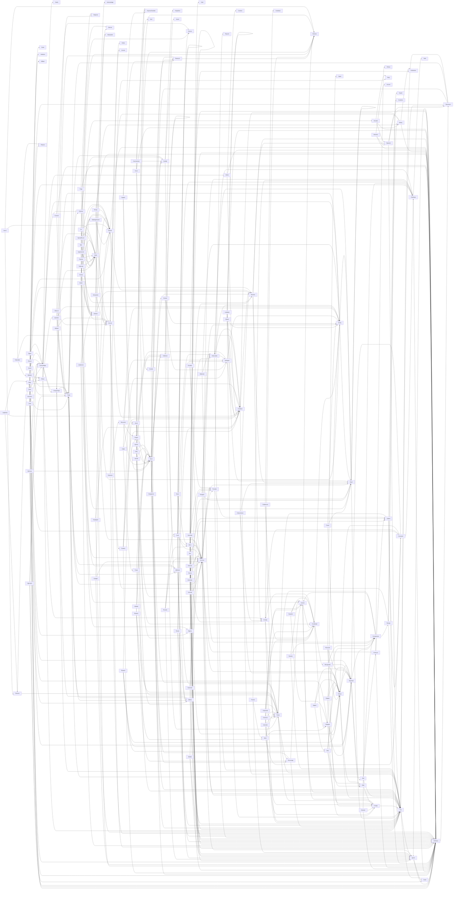

# Interaction Mapping Diagram

```mermaid
flowchart LR
  %% ===========
  %% Openers / Contact
  %% ===========
  Greet --> Acknowledge
  Greet --> GreetBack[Greet]
  Greet --> Ignore
  Greet --> Withdraw

  Introduce --> Acknowledge
  Introduce --> IntroduceBack[Introduce]
  Introduce --> Probe
  Introduce --> Withdraw

  Acknowledge --> Continue[Clarify]
  Acknowledge --> ChangeTopic
  Acknowledge --> Exit[Exit]

  Interrupt --> Allow[Yield]
  Interrupt --> Confront
  Interrupt --> Ignore
  Interrupt --> Exit

  Approach --> Acknowledge
  Approach --> Avoid
  Approach --> Withdraw
  Approach --> Probe

  Withdraw --> Reconnect
  Withdraw --> Ignore

  Ignore --> Avoid
  Ignore --> Withdraw
  Ignore --> Confront

  Avoid --> Withdraw
  Avoid --> Exit

  Reconnect --> Greet
  Reconnect --> Bond
  Reconnect --> Probe
  Reconnect --> Exit

  %% ===========
  %% Bonding / Support
  %% ===========
  Befriend --> Bond
  Befriend --> Acknowledge
  Befriend --> Deflect
  Befriend --> Withdraw

  Bond --> Confide
  Bond --> Encourage
  Bond --> Celebrate
  Bond --> Exit

  Support --> Gratitude[ExpressGratitude]
  Support --> Bond
  Support --> Reassure
  Support --> Assist

  Comfort --> Reassure
  Comfort --> Confide
  Comfort --> Withdraw

  Reassure --> Trusting[Disclose]
  Reassure --> Bond
  Reassure --> ChangeTopic

  Encourage --> Commit
  Encourage --> Bond
  Encourage --> Exit

  Celebrate --> Celebrate
  Celebrate --> Praise
  Celebrate --> Bond

  Commiserate --> Confide
  Commiserate --> Comfort
  Commiserate --> Vent

  %% ===========
  %% Trust / Disclosure
  %% ===========
  Confide --> Empathize
  Confide --> Reassure
  Confide --> Probe
  Confide --> Withhold

  Disclose --> Acknowledge
  Disclose --> Probe
  Disclose --> Verify
  Disclose --> Confide

  Withhold --> Probe
  Withhold --> Deflect
  Withhold --> Distrust[Distrust]
  Withhold --> Exit

  Deflect --> Probe
  Deflect --> ChangeTopic
  Deflect --> Confront
  Deflect --> Exit

  Probe --> Disclose
  Probe --> Withhold
  Probe --> Deflect
  Probe --> Confront

  Verify --> Confirm[Acknowledge]
  Verify --> Accuse
  Verify --> Clarify

  Confess --> Forgive
  Confess --> Condemn
  Confess --> Apologize
  Confess --> Withdraw

  Reveal --> Acknowledge
  Reveal --> Probe
  Reveal --> Expose

  Obscure --> Skepticism[Skeptical]
  Obscure --> Probe
  Obscure --> Accuse

  %% ===========
  %% Cooperation / Coordination
  %% ===========
  Cooperate --> Coordinate
  Cooperate --> Praise
  Cooperate --> Commit
  Cooperate --> Exit

  Coordinate --> Comply
  Coordinate --> Delegate
  Coordinate --> Clarify
  Coordinate --> Renegotiate

  Collaborate --> Coordinate
  Collaborate --> Contribute
  Collaborate --> Praise

  Assist --> Gratitude
  Assist --> Coordinate
  Assist --> Bond

  Delegate --> Accept[Comply]
  Delegate --> Refuse
  Delegate --> Clarify
  Delegate --> Negotiate

  Volunteer --> Accept
  Volunteer --> Praise
  Volunteer --> Coordinate

  Comply --> Praise
  Comply --> Trusting
  Comply --> Exit

  Cover --> Gratitude
  Cover --> Bond
  Cover --> Betray

  %% ===========
  %% Authority / Hierarchy
  %% ===========
  Command --> Comply
  Command --> Refuse
  Command --> Challenge
  Command --> Negotiate

  Request --> Offer
  Request --> Assist
  Request --> Refuse
  Request --> Negotiate

  Demand --> Comply
  Demand --> Refuse
  Demand --> Confront
  Demand --> Deescalate

  Submit --> Command
  Submit --> Praise
  Submit --> Exploit[Exploit]
  Submit --> Exit

  Defer --> Command
  Defer --> Delegate
  Defer --> Praise

  Assert --> Acknowledge
  Assert --> Challenge
  Assert --> Negotiate

  Challenge --> Confront
  Challenge --> Deescalate
  Challenge --> Withdraw
  Challenge --> Yield

  Dominate --> Submit
  Dominate --> Confront
  Dominate --> Withdraw

  Overrule --> Accept
  Overrule --> Challenge
  Overrule --> Withdraw

  %% ===========
  %% Influence / Persuasion
  %% ===========
  Persuade --> Accept
  Persuade --> Refuse
  Persuade --> Counterargue[Argue]
  Persuade --> Negotiate

  Convince --> Accept
  Convince --> Praise
  Convince --> Commit

  Argue --> Argue
  Argue --> Clarify
  Argue --> Deescalate
  Argue --> Exit

  Debate --> Debate
  Debate --> Clarify
  Debate --> Condemn
  Debate --> Exit

  Appeal --> Offer
  Appeal --> Refuse
  Appeal --> Negotiate

  Pressure --> Resist[Refuse]
  Pressure --> Confront
  Pressure --> Submit
  Pressure --> Withdraw

  Manipulate --> Suspect[Distrust]
  Manipulate --> Accuse
  Manipulate --> Countermanip[Manipulate]
  Manipulate --> Withdraw

  Gaslight --> Accuse
  Gaslight --> Withdraw
  Gaslight --> Confront

  Frame --> Clarify
  Frame --> Argue
  Frame --> Refuse

  Spin --> Skepticism
  Spin --> Verify
  Spin --> Argue

  %% ===========
  %% Negotiation / Exchange
  %% ===========
  Negotiate --> Counteroffer[Offer]
  Negotiate --> Compromise
  Negotiate --> Refuse
  Negotiate --> Stall

  Bargain --> Counteroffer
  Bargain --> Compromise
  Bargain --> Refuse

  Offer --> Accept
  Offer --> Refuse
  Offer --> Counteroffer
  Offer --> Negotiate

  Counteroffer --> Accept
  Counteroffer --> Refuse
  Counteroffer --> Compromise

  Compromise --> Commit
  Compromise --> Praise
  Compromise --> Renege

  Accept --> Praise
  Accept --> Commit
  Accept --> Exit

  Refuse --> Negotiate
  Refuse --> Confront
  Refuse --> Exit

  Stall --> Probe
  Stall --> Pressure
  Stall --> Exit

  Renegotiate --> Negotiate
  Renegotiate --> Refuse
  Renegotiate --> Compromise

  Renege --> Accuse
  Renege --> Grievance[Condemn]
  Renege --> Withdraw
  Renege --> Betray

  %% ===========
  %% Conflict / Antagonism (social)
  %% ===========
  Disagree --> Argue
  Disagree --> Clarify
  Disagree --> Deescalate
  Disagree --> Exit

  Oppose --> Argue
  Oppose --> Confront
  Oppose --> Withdraw

  Criticize --> Clarify
  Criticize --> Defend[Assert]
  Criticize --> Apologize
  Criticize --> Insult

  Accuse --> Deny[Clarify]
  Accuse --> Confess
  Accuse --> Counteraccuse[Accuse]
  Accuse --> Withdraw

  Confront --> Deescalate
  Confront --> Argue
  Confront --> Threaten
  Confront --> Exit

  Provoke --> Ignore
  Provoke --> Mock
  Provoke --> Insult
  Provoke --> Confront

  Undermine --> Confront
  Undermine --> Defame
  Undermine --> SabotageSocial[SabotageSocial]
  Undermine --> Withdraw

  SabotageSocial --> Expose
  SabotageSocial --> Accuse
  SabotageSocial --> Betray

  Harass --> Withdraw
  Harass --> Confront
  Harass --> Sanction

  Intimidate --> Submit
  Intimidate --> Withdraw
  Intimidate --> Confront
  Intimidate --> Threaten

  %% ===========
  %% Hostility / Harm
  %% ===========
  Insult --> Ignore
  Insult --> Mock
  Insult --> Insult
  Insult --> Confront
  Insult --> Deescalate
  Insult --> Withdraw

  Mock --> Ignore
  Mock --> Mock
  Mock --> Confront
  Mock --> Withdraw

  Humiliate --> Withdraw
  Humiliate --> Revenge[Undermine]
  Humiliate --> Confront
  Humiliate --> Threaten

  Threaten --> Withdraw
  Threaten --> Submit
  Threaten --> SeekHelp[Request]
  Threaten --> Confront

  Shame --> Withdraw
  Shame --> Apologize
  Shame --> Condemn
  Shame --> Deflect

  Belittle --> Ignore
  Belittle --> Confront
  Belittle --> Withdraw

  Ostracize --> Withdraw
  Ostracize --> AppealToGroup[Rally]
  Ostracize --> Reconcile[Reconcile]

  Scapegoat --> Condemn
  Scapegoat --> Expose
  Scapegoat --> Withdraw

  %% ===========
  %% Deception / Betrayal
  %% ===========
  Lie --> Verify
  Lie --> Accuse
  Lie --> Distrust
  Lie --> Expose

  Mislead --> Verify
  Mislead --> Probe
  Mislead --> Accuse

  Conceal --> Probe
  Conceal --> Distrust
  Conceal --> Withdraw

  Feign --> Verify
  Feign --> Suspect
  Feign --> Withdraw

  Impersonate --> Verify
  Impersonate --> Expose
  Impersonate --> Sanction

  Fabricate --> Verify
  Fabricate --> Expose
  Fabricate --> Defame

  Entrap --> Withdraw
  Entrap --> Accuse
  Entrap --> Expose

  Bait --> Ignore
  Bait --> Confront
  Bait --> Withdraw

  Betray --> Accuse
  Betray --> Condemn
  Betray --> Withdraw
  Betray --> Revenge

  %% ===========
  %% Loyalty / Repair
  %% ===========
  Commit --> Trusting
  Commit --> Coordinate
  Commit --> Exit

  Promise --> Verify
  Promise --> Trusting
  Promise --> Commit

  Uphold --> Praise
  Uphold --> Trusting
  Uphold --> Bond

  Defect --> Condemn
  Defect --> Withdraw
  Defect --> Pursue[Confront]

  Abandon --> RelationalThreat[Accuse]
  Abandon --> Withdraw
  Abandon --> Separate

  Reconcile --> Apologize
  Reconcile --> Forgive
  Reconcile --> Bond

  Forgive --> Bond
  Forgive --> Trusting
  Forgive --> Exit

  Apologize --> Forgive
  Apologize --> Condemn
  Apologize --> Clarify

  %% ===========
  %% Judgment / Reputation
  %% ===========
  Judge --> Clarify
  Judge --> Condemn
  Judge --> Approve[Praise]

  Approve --> Praise
  Approve --> Bond

  Disapprove --> Criticize
  Disapprove --> Sanction
  Disapprove --> Exit

  Validate --> Bond
  Validate --> Encourage

  Condemn --> Deescalate
  Condemn --> Sanction
  Condemn --> Exit

  Endorse --> Praise
  Endorse --> Rally

  Question --> Clarify
  Question --> Probe
  Question --> Verify

  Respect --> Defer
  Respect --> Bond
  Respect --> Praise

  %% ===========
  %% Reputation mechanics
  %% ===========
  Praise --> Bond
  Praise --> Encourage
  Praise --> Exit

  Gossip --> Verify
  Gossip --> Defame
  Gossip --> Expose
  Gossip --> Withhold

  Rumor[SpreadRumor] --> Verify
  Rumor --> Defame
  Rumor --> Expose

  Defame --> Confront
  Defame --> Expose
  Defame --> Sanction

  Vouch --> Trusting
  Vouch --> Endorse
  Vouch --> Verify

  Expose --> Condemn
  Expose --> Sanction
  Expose --> Withdraw

  Boast --> Mock
  Boast --> Praise
  Boast --> Challenge

  Posture --> Challenge
  Posture --> Defer
  Posture --> Ignore

  Signal --> Acknowledge
  Signal --> Probe
  Signal --> Align[Affiliate]

  %% ===========
  %% Norms / Inclusion / Sanctions
  %% ===========
  EnforceNorms[EnforceNorm] --> Comply
  EnforceNorms --> Refuse
  EnforceNorms --> Sanction
  EnforceNorms --> Argue

  Sanction --> Comply
  Sanction --> Argue
  Sanction --> Withdraw
  Sanction --> Separate

  Legitimize --> Endorse
  Legitimize --> Rally
  Legitimize --> Condemn

  Invalidate --> Argue
  Invalidate --> Condemn
  Invalidate --> Withdraw

  Include --> Bond
  Include --> Celebrate
  Include --> Coordinate

  Exclude --> AppealToGroup
  Exclude --> Withdraw
  Exclude --> Separate

  %% ===========
  %% Closure / Resolution
  %% ===========
  Clarify --> Acknowledge
  Clarify --> ChangeTopic
  Clarify --> Argue

  ChangeTopic --> Acknowledge
  ChangeTopic --> Probe
  ChangeTopic --> Exit

  Escalate --> Confront
  Escalate --> Threaten
  Escalate --> Withdraw

  Deescalate --> Clarify
  Deescalate --> Apologize
  Deescalate --> Exit

  Resolve --> Compromise
  Resolve --> Commit
  Resolve --> Exit

  Separate --> Withdraw
  Separate --> Exit
  Separate --> Reconnect

  Exit --> Reconnect
  Exit --> Ignore

  %% ===========
  %% Group dynamics
  %% ===========
  Rally --> Follow[Follow]
  Rally --> Polarize[Polarize]
  Rally --> Negotiate
  Rally --> Condemn

  Organize --> Coordinate
  Organize --> Delegate
  Organize --> Commit

  Mobilize --> Follow
  Mobilize --> Oppose
  Mobilize --> Sanction

  Unify --> Bond
  Unify --> Coordinate
  Unify --> Celebrate

  Divide --> Oppose
  Divide --> Defame
  Divide --> Exclude

  Radicalize --> Condemn
  Radicalize --> Mobilize
  Radicalize --> Polarize

  Moderate --> Deescalate
  Moderate --> Clarify
  Moderate --> Compromise

  Lead --> Follow
  Lead --> Delegate
  Lead --> Command

  Follow --> Comply
  Follow --> Question
  Follow --> Defect
```