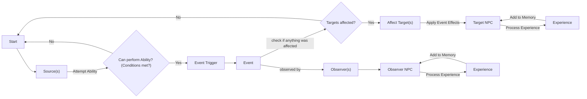

The [[Simulae Event System]] is the process by which the [[Simulae NGIN]] propagates the information that is created by a [[Simulae Event]] back into the world model and other [[Simulae Systems]]

### Diagram

