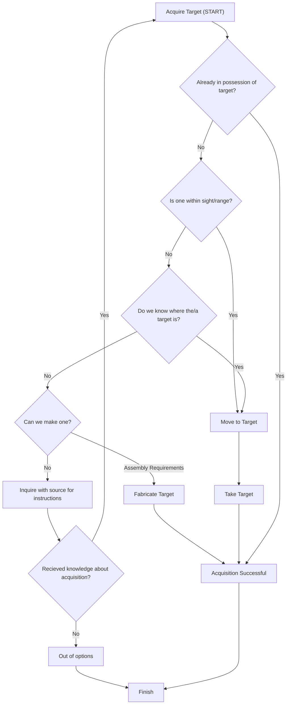

The task-planning system is a form of GOAP (Goal-Oriented Action Planning) which upon issuance of a [[Task]], will deconstruct it's goal and construct a [[Plan]] as a sequence of simplified [[Task]]s which can be performed programatically.

The majority of actions an NPC would engage in mostly involve a few specific core actions:

| Action        | Description                              | Examples                                                                                                                                      |
| ------------- | ---------------------------------------- | --------------------------------------------------------------------------------------------------------------------------------------------- |
| Movement      | Navigating the physical world.           | Going to a specified location. Avoiding/Fleeing a moving target. Searching for a quest goal. etc                                              |
| Acquisition   | Obtaining an inanimate object            |                                                                                                                                               |
| Interaction   | Interacting with inanimate objects.      | Opening a container, picking up objects, using machinery, etc.                                                                                |
| Socialization | Interacting with other sentient entities | Greeting strangers. Relaying information to a commanding officer. Being betrayed by a loved one. Negotiating a business deal or peace treaty. |

# Acquisition Breakdown Process

### Example task breakdown: 

- Task: A farmer must make a table for his house
- Breakdown: The farmer requires a tabletop and legs to assemble the table
	- The legs must be made from wood logs turned on a lathe
		- The lathe (workstation) is known to be in the workshop
		- The wood logs must be made from sawn logs
			- The saw (tool object) is known to be in the workshop
			- The sawn logs are made from tree logs
				- The tree logs are harvested by chopping down trees with an axe
					- Trees are known to be in the nearby forest
					- The axes is known to be in the workshop
	- The tabletop must be made from wood planks
		- Wood planks are made by running wood logs through a planer
			- The planer (workstation) is known to be in the workshop
			- The wood logs must be made from sawn logs
				- (duplicate from above)
	- The pieces must be assembled with screws
		- Screws are known to be in the workshop
- Resultant Task sequence:
	1. Acquire the Axe
		1. Go to the axe
		2. take the axe
	2. Chop down trees (enough for required number of logs)
		1. Go to the trees
		2. Use the axe to chop down the tree(s)
	3. Bring the logs to the lathe/planer
	4. Use the lathe/planer to process the logs into sawn logs/planks
	5. Acquire the screws
	6. Assemble the pieces into a table
	7. Goal-state reached

#### Additional breakdown

- If the farmer doesn't readily have screws, perhaps they have to go purchase a box of screws from a local store or substitute nails for the screws and purchase them from a local blacksmith
- Perhaps the farmer's axes must be sharpened in order to effectively cut down the trees, and must be brought to a sharpening stone.
- ...