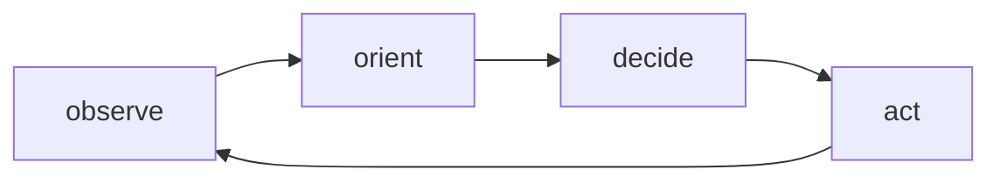

[[Simulae Actor]]'s are 'Sentient' [[SimulaeNode]] entities that have agency over themselves, surroundings, and other sentient entities. 

They can interact with other sentient entities via the [[Socialization]] system, and can perform complex tasks based on their breakdown of these tasks into sequences of simpler subtasks via the [[Plan]] system

## Actor OODA Loop

The OODA-loop (observe, orient, decide, act) is a decision-making process model developed and used by the US Military since the 1970s. It's a high-level understanding of how people process and react to stimuli in the world.

This same model can be applied to our [[Simulae Actor]]s as they are modeled to function in a similar manner. 

