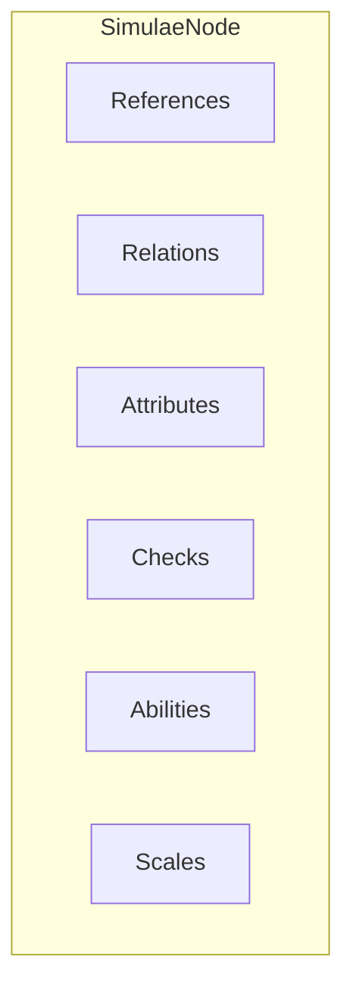

The [[SimulaeNode]] is the basic structure used in [[Simulae]] to represent all physical objects and their relationships in a unified object model.
# Diagram

## [[References]]

The 'References' structure is designated with containing information that is best represented as string values, meaning that this is a string-to-string dictionary
## [[Relations]]

The 'Relations' structure contains nested lookups forming a tree which details the physical relationship between the [[SimulaeNode]] and other SimulaeNodes with a direct physical relationship.
These relationships are detailed in this structure when they are 'inseparable' from the subject, meaning that if one were to move the subject SimulaeNode, the ones detailed in these structures would also be affected by that relocation (either by accompanying it or would have their relationship's changed/removed as a result of that process)
## [[Attributes]]

## [[Checks]]

## [[Abilities]]
The abilities structure details the actions that can be performed by the entity. 
## [[Scales]]
The scales structure is designated with containing additional grouped lookups
## [[Memories]]
The memory system is still under-development

# Systems

SimulaeNodes intelligently interact with other SimulaeNodes using several important and in-depth systems. 
