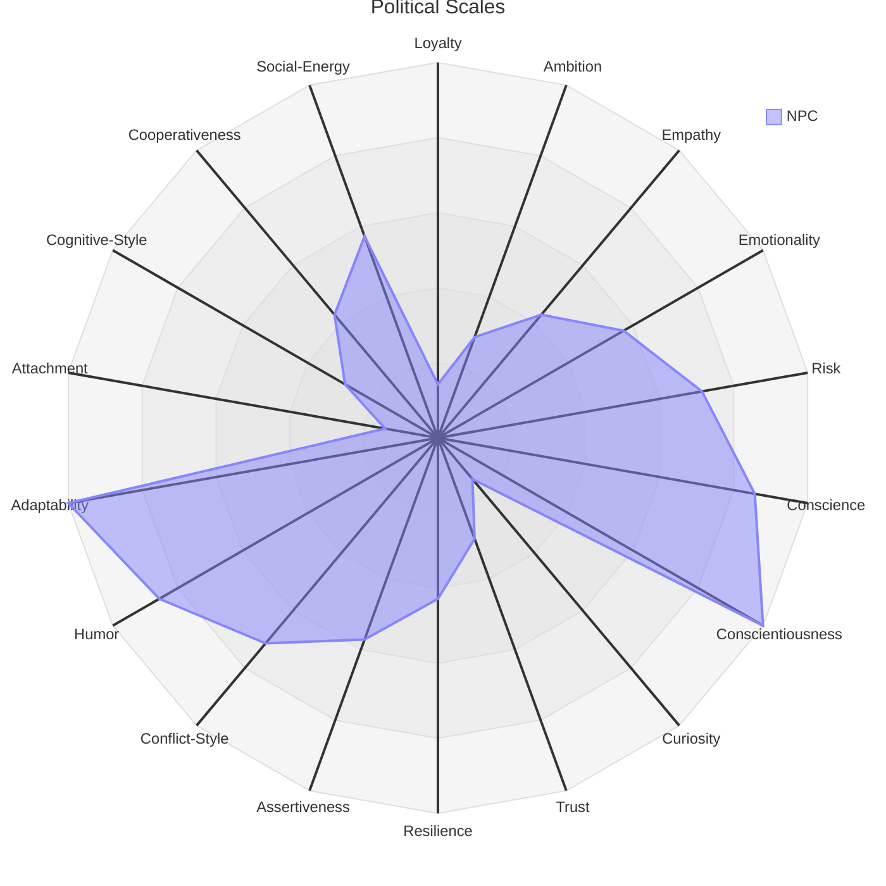

The Personality [[Scales]] are a series of axes that attempt to approximate the many aspects of a human psyche in a data structure through which can be calculated appropriate reactions, responses, and priorities of a given [[Simulae Actor]]'s interactions in the [[Socialization]]

## Diagram

![[personality-scales-diagram.png]]

