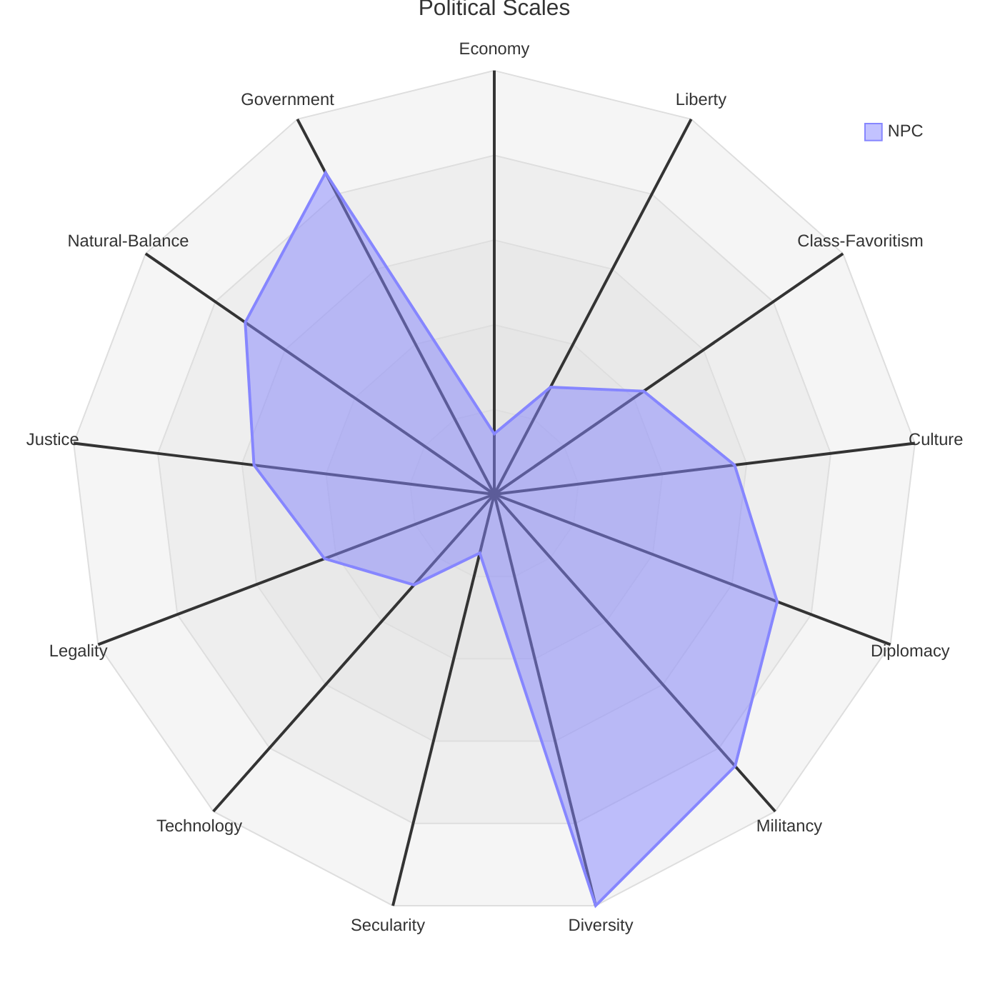

The Political [[Scales]] are a series of axes that attempt to represent a given entity's outlook on political topics
## Diagram

![[political-scales-diagram.png]]Diagram:

```mermaid

radar-beta
	title Political Scales
	
	axis eco["Economy"]
	axis lib["Liberty"]
	axis class["Class-Favoritism"]
	axis culture["Culture"]
	axis dipl["Diplomacy"]
	axis mil["Militancy"]
	axis div["Diversity"]
	axis sec["Secularity"]
	axis tech["Technology"]
	axis leg["Legality"]
	axis just["Justice"]
	axis natbal["Natural-Balance"]
	axis gov["Government"]
	  
	curve NPC{1,2,3,4,5,6,7,1,2,3,4,5,6}
	graticule polygon
	max 7
	min 0
```
