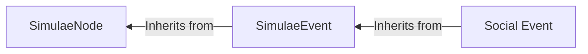

[[Social Event]]s are a subtype of a [[Simulae Event]] which specifically relates to the abstract concept of a 'social interaction' codified into a data structure formatted for use a [[Simulae Actor]] (Sentient Simulae Entity) which, through socialization, experiences and generates these events in doing so. 

## Types of Events

| Core Interactions | Subtypes                                                                   |
| ----------------- | -------------------------------------------------------------------------- |
| Open              | Greet, Initiate                                                            |
| Close             | Farewell, Withdrawl, sever-ties                                            |
| Turn              | Interrupt, Cede-priority, stall/filler (phatic)                            |
| Topic             | Change-Topic                                                               |
| Inform            | Claim (disclose, reveal, confess, observer, clarify, retract)              |
| Inquire           | ask, probe, challenge                                                      |
| Stance            | confirm/deny, agree/disagree, accept/refuse, validate/invalidate           |
| Influence         | persuade/dissuade, pressure, threaten                                      |
| Affect            | Comfort, commiserate, praise, criticize, insult, apologize, joke, complain |
| Direct            | Request, demand, command, task, delegate                                   |
| Negotiate         | offer, counteroffer                                                        |
| Coordinate        | Rally, organize, promote/demote, resign, accompany, plan, etc              |
| Deceive           | mislead, conceal, feign, impersonate, entrap, cover                        |
| Summary           | reflect (individual recap with transform?), summary (full recap)           |
## Qualifiers

Qualifiers are important metadata attached to a given [[Social Event]]s that indicate additional information and designate categories about it that may be relevant to interpretation.

- Domain 
	- Identity -- Relates to the identity of a [[SimulaeNode]] (Title, name, role, occupation, etc)
	- Fact -- A statement describing something. 
	- Plan -- Describes a [[Plan]]
	- Task -- An instruction 
	- Resource -- 
- Polarity 
	- Pro- -- Contextually indicates agreement, support, escalation, etc
	- Anti- -- Contextually indicates disagreement, denial, etc.
	- Neutral -- No polarity indicated, which itself could be information
- Force 
	- None -- No intensity or hostility
	- Low -- Subtle implications or vague threats
	- High -- Alarming intensity, overt threats, etc
- Honesty 
	- Truthful -- 
	- Deceptive -- 
	- Uncertain -- 
- Visibility 
	- private
	- dyadic
	- public
- Evidence 
	- None
	- Weak
	- Strong
	- Perfect
- Emotion -- Expression of a primary or derivative emotion
	- Joy
	- Rage
	- Sadness
	- Fear
	- Surprise
	- Disgust
	- Love
	- Anticipation
	- Contentment
	- Hope
	- Shame
	- Envy
	- Pride
- Authority -- The nature of authority between the source and receiver
	- Peer
	- Superior
	- Subordinate
	- None
	- Unknown
	- External 
- Time -- The time-range associated with the information (past/present/future-tense)
	- Current
	- Ongoing 
	- Future
	- Past

## Most-Likely Responses

While internally, each response will be evaluated for its merit as a valid response for a given [[Simulae Actor]]s reaction to a prompting [[Social Event]], a smaller set of "most-likely responses" can provide an optimization / shortcut to a possibly more costly calculation.
#### Most-Likely Responses per given [[Social Event]]

- Open ("Hello!")
	- Open (response greeting) ("Hey! Good Morning.)
	- Inquiry ("Who are you? / How was your day?")
	- Express emotion ("")
- Close
	- Close ("Okay, goodbye") 
	- ...
- Turn
	- Interruption
		- Affect ("Dont you dare interrupt me!")
		- ...
	- Cede-Priority
		- ...
- Topic
	- ...
- Inform (statement, clarification, observation, retraction.)
	- Inquire ("how do you know that?")
	- Inform (Provide counter-evidence)
- Inquire
	- Inform (answer question)
	- Deceive (answer question dishonestly)
	- Phatic (filler/non-answer)
	- Stance (Refuse to answer)
	- Inform (ignore and continue)
- Stance
	- ...
- Influence
	- ...
- Affect
	- ....
- Direct
	- Request / Demand
		- Stance (Accept/Deny)
	- Task
		- Stance (Accept/Deny)
		- Inquire (Ask question about given task)
		- Inform (Task is incorrect)
		- ...
	- ...
- Negotiate
	- Stance (Accept/Refuse offer)
	- Negotiate (provide counteroffer)
	- Inquire ("Are you sure?")
	- Inform ("I know that this right here...")
- Coordinate
	- ...
- Deceive (Not expressed to other party)
	- ...
- Summary
	- Inform (provide additional detail or clarification)
	- ...

### Resolving `Inform` / `Inquire` Content

If an NPC has already selected `Inform` or `Inquire`, the next step is to resolve a **topic payload** (what exactly they are talking about).

Use this deterministic pipeline:

1. Build candidate topics from:
	- Prompting event (`social_event`) fields (`domain`, `topic`, `subject`, `claim`, `question`, `evidence`, `time`)
	- Recent `conversation_history` (prior asks/claims, with recency bias)
	- NPC memory buckets (claims, commitments, social threads, etc)
2. Normalize each candidate into:
	- `domain`
	- `topic`
	- `subject`
	- `details`
	- `evidence`
	- `time`
	- `source`
	- `certainty` and `salience` (internal scoring metadata)
3. Score candidates:
	- Base: `salience`
	- `Inform` boosts high-certainty items and unanswered recent inquiries
	- `Inquire` boosts low-certainty / weak-evidence / missing-field items
	- Boost same-domain and same-topic as the triggering event
4. Pick top score and emit a payload:
	- `Inform` -> `{ response_type: "Inform", intent: "answer_or_share", information_target: {...} }`
	- `Inquire` -> `{ response_type: "Inquire", intent: "ask_for_evidence|ask_for_timeframe|ask_for_subject|ask_for_clarification", inquiry_target: {...} }`

This separates:

- **Response selection** (what type of act to take)
- **Content resolution** (what information act to perform)

Implementation reference:

- `NGIN/NGIN_Socialization.py`: `resolve_information_response_payload(...)`
- `NGIN/NGIN_AI.py`: `resolve_selected_response_content(...)`
