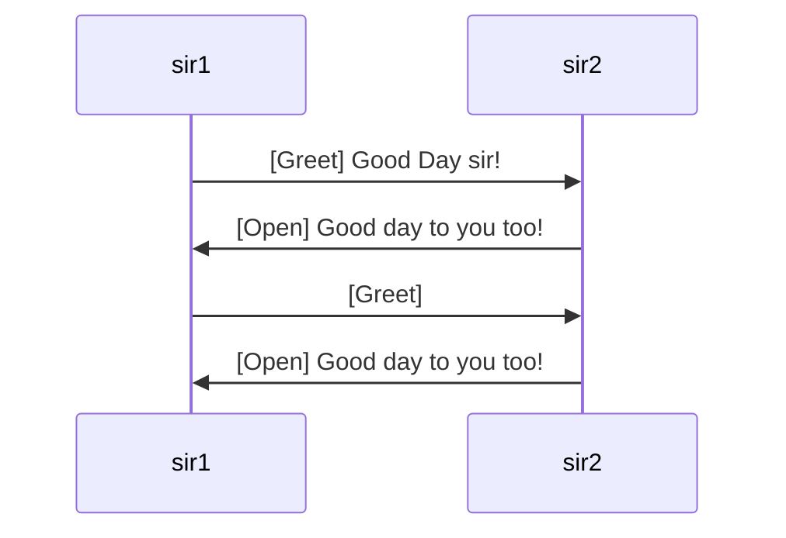

The socialization system exists to facilitate realistic interactions between sentient entities.
## Conversation Flow

A conversation between two NPC's will be composed of [[Social Event]] in a realistic format:
1. A greeting or other 'open'ing action
2. A loop of prompts and responses
3. Eventually a termination case

### Starting social engagements

While one might expect social interactions to always begin with an 'open' or 'greet' action, that is not always the case in reality. Often we begin engagements by other kinds of actions. 

> Example: getting an employee's attention by asking if they work at the current location functions as an 'Inquiry' action while also initiating an exchange
### [[Responses]]

[[Responses]] are the majority of a conversation, as everything that follows an initiating action is a 'response' to it. Even in a 'one-sided' conversation in which one entity attempts to speak to another when their partner remains silent, they are in-fact responding to the other's silence
### Termination

Termination cases cause the social engagement to cease. Though categorically they fall under the purview of [[Responses]].
These termination cases include anything that may interrupt the normal flow of an exchange or just the natural endpoint of an exchange. 

An inexhaustive list of Termination Cases:
- One agent chooses a 'Close' action
	- Wishes to end the conversation due to a certain reason such as:
		- A status attribute has exceeded a specific threshold
			- Stress-level has risen too high (stressful conversation may trigger an entity's shutdown)
			- Perceived value of continuing the conversation has declined (not worth arguing with someone and getting nowhere, for example)
		- [[Simulae Actor]] may decide to end the conversation to begin/continue pursuing a [[Task]] or executing a [[Plan]] (gotta get back to work)
		- ...
- An interrupting event occurs that immediately demands the attention of one or all of the participants
	- An alarming event such as an ambush (sudden engagement of hostile violent action)
	- ...