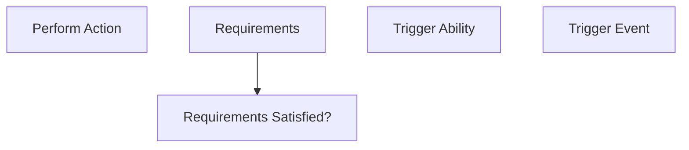

The abilities structure details the various actions that can be performed by the SimulaeNode. These actions may have:
- Requirements
- Prerequisites

```mermaid

flowchart TB
	perfAction["Perform Action"]
	satCheck["Requirements Satisfied?"]
	reqs["Requirements"]
	
	tAbility["Trigger Ability"]
	tEvent["Trigger Event"]
	
	reqs --> satCheck

```

