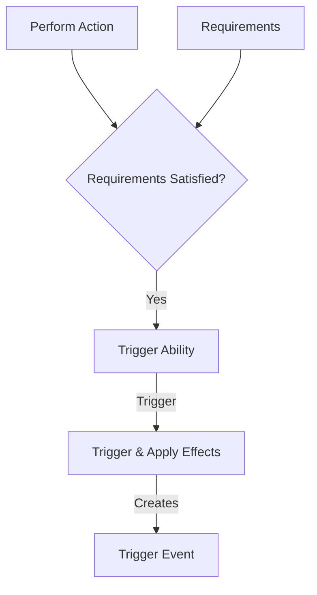

The abilities structure details the various actions that can be performed by the SimulaeNode. These actions may have:
- Requirements
- Prerequisites
- Effects

```json
Ability = {
	'id': '...',
	'name': 'ability_name',
	'requirements': [...],
	'activation': 'activate',
	'effects': [
		{
			'conditions': [...],
			'': [],
			'event': {...},
		},
		...	
	],
	
}
```





## Ability Requirements

The requirements for abilities are [[Simulae Condition]]s.

When applicable, can be combinations of physical components ([[SimulaeNode]]s) or satisfied states

> ex: A spell may require a `mana` level above 50 points and a spell-component such as a wand and/or a crystal which may be consumed in the process of casting

## Ability Activation Type

The `activation` property indicates what causes the ability to activate. 
There are a few kinds of default triggers:

| Activation | Description                                                               |
| ---------- | ------------------------------------------------------------------------- |
| Action     | Ability can be activated by choice                                        |
| Reaction   | Ability is activated by an event                                          |
| Passive    | Ability is always activate, and may trigger its effect events perpetually |
> note: The effect conditions must be satisfied in order to take effect.
# Ability Effects

Ability's `Effects` list are by default nebulous and configurable.

Possible effects may include:
- Updating a target [[SimulaeNode]]'s state 
	- [[References]]
	- [[Attributes]]
	- [[Relations]]
	- [[Abilities]] - Cause them to be disabled/fail/upgrade/etc
	- [[Memories]] - Causing hallucinations or erasing memories
- Generating abstract events

### Effect conditions

An effect may have conditions which must be satisfied in order to be performed.

> ex: in order to perform the action 'resurrect' the target's status must be 'Dead'