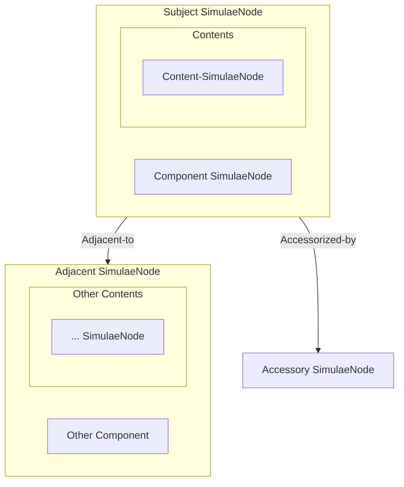

The 'Relations' structure contains nested lookups forming a tree which details the physical relationship between the [[SimulaeNode]] and other SimulaeNodes with a direct physical relationship.
These relationships are detailed in this structure when they are 'inseparable' from the subject, meaning that if one were to move the subject SimulaeNode, the ones detailed in these structures would also be affected by that relocation (either by accompanying it or would have their relationship's changed/removed as a result of that process)

> Example: A node representing a building is 'relocated' to another place. Here's what would happen:
> 	- It's Walls and Rooms of which it is composed are also relocated
> 	- Furniture and people inside are also relocated
> 	- The building's links/pathways leading in/out from/to the structure have their links broken as the building is no longer there.
> 	- Someone on the roof of the building, or hanging onto the side of the building may remain held to the side of the structure *or* fall off of it along it's journey or remain at the initial location
> 	- If a magic portal still exists that teleports a SimulaeNode inside of the building regardless of where it is, would *not* have it's relationship broken.

## Tree Structure

| Relation    | Description                                                                                                                       |
| ----------- | --------------------------------------------------------------------------------------------------------------------------------- |
| Components  | The SimulaeNodes that make-up the given 'Product' SimulaeNode (ex: the Table-legs and the Table-top which make up a Table object) |
| Contents    | The SimulaeNodes that are held within the 'Containing' SimulaeNode (ex: gold or loot in a treasure-chest)                         |
| Accessories | The SimulaeNodes that are attached to (externally), but not apart of, the 'Accessorized' SimulaeNode                              |
| Adjacents   | The SimulaeNodes that are located 'adjacent' to the given SimulaeNode.                                                            |
> Note: This is not an exhaustive list of 'Relations' as this structure is designed to be extensible, allowing for other types of 'relations' between SimulaeNodes beyond what is listed.




> ex: Relations
```json
Relations = {
	'Components': {...},
	'Contents': {...},
	'Accessories': {...},
	'Adjacents': {...},
}
```
## Components

## Contents

## Accessories

## Adjacents

