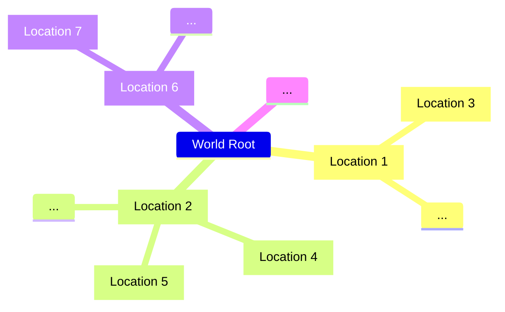

While the [[World Generator]] may generate many [[Locations]] that comprise a certain 'world', a single 'location' may initially include a 'population' of [[Simulae Actor]](s)

## Initial Implementation Structure

A 'location' is an abstract type of [[SimulaeNode]] organized as discrete 'places' organized in a network of other [[Locations]] connected as an adjacency-matrix by linking pairs as 'adjacent' [[Relations]]

In the future, for a more realistic world-model, discrete '[[Locations]]' may instead be used as spacial 'zones' in a continuous 3-dimensional space instead of the entire make-up of the world itself.

