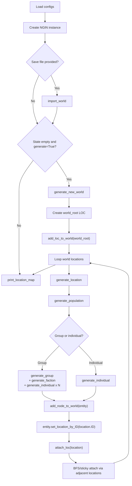
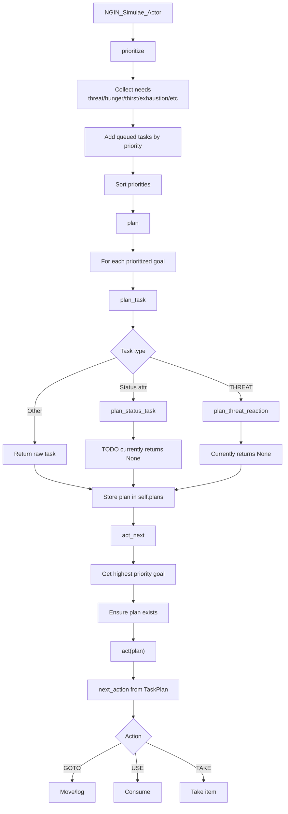
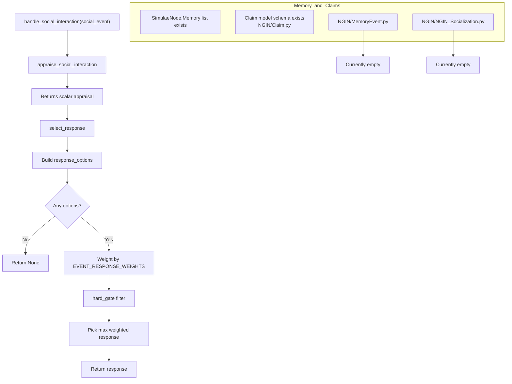

# CampaignGenerator (Simulae / NGIN)

Adaptive and modular campaign/world generator for RPG scenarios, with a Simulae node model, world generation, and early AI/socialization scaffolding.

## Project Status (Last Verified: February 17, 2026)

### Core Data Model
- [x] `SimulaeNode` entity model (references, attributes, relations, checks, scales, memory list)
- [x] Personality and policy scale generation for social nodes
- [x] Serialization helpers (`toJSON`, `simulaenode_from_json`) and node factory helpers
- [x] Unit test coverage for current `SimulaeNode` behavior
- [ ] Relation search/filtering is fully implemented (`get_relations_by_criteria` is still a TODO placeholder)

### World / Campaign Generation
- [x] `NGIN/SimulaeCampaignGenerator.py` main generator and console loop
- [x] Basic world/location/entity generation flow
- [x] Action selection and action-resolution scaffolding
- [ ] Mission outcomes are fully integrated into long-term world state
- [ ] Actor/non-actor behavior depth is complete (multiple TODOs remain)

### AI / Socialization
- [x] `NGIN_Simulae_Actor` planning/prioritization scaffolding in `NGIN/NGIN_AI.py`
- [x] Basic status-need checks (hunger/thirst/exhaustion/etc.)
- [ ] Encounter appraisal pipeline (`appraise_event`, `appraise_encounter`) implementation
- [ ] Social interaction appraisal/response ranking implementation

### Memory / Claims
- [x] Claim model skeleton exists (`NGIN/Claim.py`)
- [ ] Episodic memory event structure implementation (`NGIN/MemoryEvent.py` is currently empty)
- [ ] Socialization module implementation (`NGIN/NGIN_Socialization.py` is currently empty)
- [ ] Memory -> claim extraction -> social model update pipeline

### API / Client
- [x] Flask API endpoint for campaign generation (`NGIN/api.py`)
- [x] API run scripts (`run_api.ps1`, `run_api.sh`)
- [x] Frontend client scaffold (`NGINClient/`, Vue + Vite)
- [ ] Full UI/UX integration with complete gameplay loop

### Testing
- [x] Test suite currently runs and passes via `python -B -m unittest -v`
- [ ] Some tests are placeholder stubs with early `return` (notably in `NGIN/test_NGIN_AI.py`)

## System Diagrams

### World-Generator (`NGIN/SimulaeCampaignGenerator.py`)



### NGIN AI Task Planning (`NGIN/NGIN_AI.py`)



### NGIN AI Socialization / Memory (Current State)



## Quick Start

### Prerequisites
- [ ] Python 3 installed
- [ ] Node.js + npm installed (for `NGINClient`)
- [ ] Python dependencies installed:

```bash
pip install -r requirements.txt
```

### Run API

PowerShell:

```powershell
./run_api.ps1
```

Bash:

```bash
./run_api.sh
```

### Run Web Client (PowerShell)

```powershell
./start_nginclient.ps1
```

### Run Terminal Campaign Generator (PowerShell)

```powershell
./generate_campaign.ps1
```

### Run Unit Tests

- PowerShell

```powershell
./run_unittests.ps1
```

- Bash

```bash
./run_unittests.sh
```

### Run Unit Tests (non-script)

```bash
python3 -m unittest discover
```

or:

```bash
python -B -m unittest -v
```

## Current Priorities

- [ ] Implement structured social memory events
- [ ] Implement appraisal model for social interactions
- [ ] Connect memory/claims/social-model updates to response selection
- [ ] Finish mission outcome/state propagation
- [ ] Replace placeholder AI/socialization tests with full assertions
